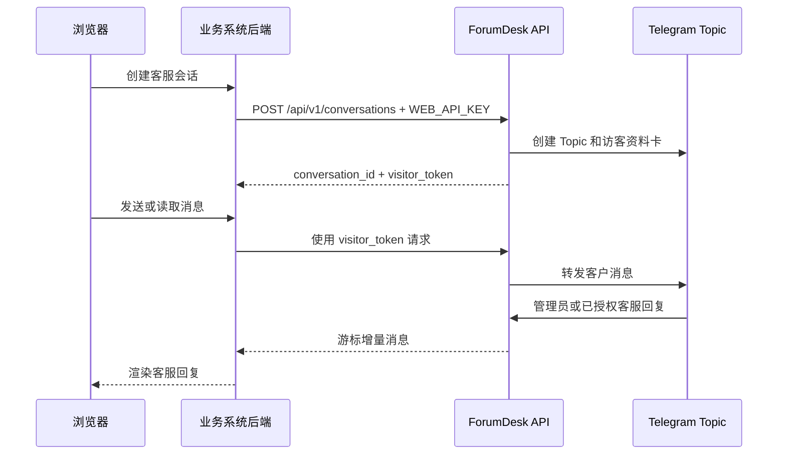

# ForumDesk Web API v1

[English](API_EN.md) · [交互式 HTML](API.html) · [OpenAPI 3.1](openapi.json) · [返回项目首页](README.md)

ForumDesk Web API 将网站访客会话接入 Telegram Forum Topic。网站后端使用集成密钥创建会话，浏览器或业务后端使用会话级 `visitor_token` 收发消息。

## 接入模型



推荐由业务后端代理 ForumDesk 请求，让 `WEB_API_KEY` 和 `visitor_token` 留在服务器端。浏览器直接使用访客 Token 时，需要配置精确的 `WEB_ALLOWED_ORIGINS`。

## 基础地址

```text
http://HOST:8080
```

Tailscale 示例：

```text
http://100.64.0.2:8980
```

## 认证

| 凭据 | 使用位置 | 请求头 |
|---|---|---|
| `WEB_API_KEY` | 创建会话，只放业务后端 | `Authorization: Bearer WEB_API_KEY` |
| `visitor_token` | 当前网页会话的消息收发 | `Authorization: Bearer VISITOR_TOKEN` |

`visitor_token` 只在创建会话时返回一次，ForumDesk 数据文件保存其 SHA-256 摘要。

## 健康检查

```http
GET /healthz
```

```bash
curl http://100.64.0.2:8980/healthz
```

```json
{"data":{"status":"ok"}}
```

## 创建会话

```http
POST /api/v1/conversations
Authorization: Bearer WEB_API_KEY
Content-Type: application/json
```

请求字段：

| 字段 | 必填 | 限制 | 说明 |
|---|---|---|---|
| `visitor_name` | 是 | 1–128 字符 | 访客显示名称 |
| `email` | 否 | 最多 254 字节 | 访客邮箱 |
| `external_id` | 否 | 最多 128 字节 | 业务系统用户或订单 ID |
| `page_url` | 否 | HTTP/HTTPS URL | 发起咨询的页面 |

```bash
curl -X POST "http://100.64.0.2:8980/api/v1/conversations" \
  -H "Authorization: Bearer $FORUMDESK_API_KEY" \
  -H "Content-Type: application/json" \
  -d '{
    "visitor_name": "张三",
    "email": "user@example.com",
    "external_id": "customer-10001",
    "page_url": "https://www.example.com/pricing"
  }'
```

`201 Created`：

```json
{
  "data": {
    "id": "wc_...",
    "visitor_token": "wv_...",
    "status": "open",
    "created_at": "2026-09-07T10:00:00Z"
  }
}
```

创建成功后，Telegram 客服群会出现对应 Topic 和访客资料卡。

## 发送消息

```http
POST /api/v1/conversations/{conversation_id}/messages
Authorization: Bearer VISITOR_TOKEN
Content-Type: application/json
```

普通消息：

```json
{"text":"我想了解商务方案"}
```

引用回复：

```json
{
  "text": "这是补充信息",
  "reply_to_message_id": "wm_..."
}
```

`text` 去除首尾空白后长度为 1–4000 字符。`reply_to_message_id` 需要指向当前会话中仍然可见的消息。

```javascript
const response = await fetch(
  `${FORUMDESK_API_BASE}/api/v1/conversations/${conversationId}/messages`,
  {
    method: "POST",
    headers: {
      Authorization: `Bearer ${visitorToken}`,
      "Content-Type": "application/json"
    },
    body: JSON.stringify({ text, reply_to_message_id: replyToId })
  }
);
```

## 增量读取消息

```http
GET /api/v1/conversations/{conversation_id}/messages?after=0&limit=50
Authorization: Bearer VISITOR_TOKEN
```

| 参数 | 默认值 | 范围 |
|---|---:|---:|
| `after` | `0` | 非负整数游标 |
| `limit` | `50` | `1–100` |

```json
{
  "data": [
    {
      "id": "wm_...",
      "conversation_id": "wc_...",
      "sequence": 12,
      "direction": "staff",
      "text": "您好，我来协助您。",
      "staff_name": "商务负责人",
      "reply_to_message_id": "wm_...",
      "visible": true,
      "created_at": "2026-09-07T10:01:00Z"
    }
  ],
  "meta": {
    "next_cursor": 12
  }
}
```

下一次请求把 `meta.next_cursor` 作为 `after`。当前示例客户端每两秒轮询一次。

### 消息方向

| `direction` | 说明 |
|---|---|
| `customer` | 网页客户消息 |
| `staff` | Telegram 客服回复 |
| `system` | 系统事件 |

### 隐藏事件

管理员在 Telegram Topic 中对已发布消息执行 `/hide` 后，API 返回：

```json
{
  "id": "wm_...",
  "direction": "system",
  "event": "message_hidden",
  "target_message_id": "wm_original",
  "sequence": 13,
  "visible": true
}
```

客户端收到后，根据 `target_message_id` 移除已渲染消息。

## Telegram 可见性命令

| 命令 | 作用 |
|---|---|
| `/allow_staff` | 回复成员消息，允许该成员在当前 Topic 自动外发 |
| `/deny_staff` | 取消成员在当前 Topic 的自动外发权限 |
| `/staff` | 查看已授权成员 |
| `/show` | 把一条内部消息发布给客户 |
| `/hide` | 把一条已发布消息转为仅管理端可见 |

群管理员发言默认对客户可见，普通成员默认仅在 Topic 内可见。

## 错误

```json
{
  "error": {
    "code": "validation_error",
    "message": "..."
  }
}
```

| HTTP 状态 | 常见含义 |
|---:|---|
| `400` | JSON、游标或分页参数错误 |
| `401` | 集成密钥或访客凭据错误 |
| `409` | 会话创建冲突 |
| `422` | 字段验证或引用目标错误 |
| `429` | 请求超过速率限制，读取 `Retry-After` |
| `500` | 存储或内部处理错误 |
| `502` | Telegram 上游请求错误 |

## 限制与安全建议

- 默认每个集成密钥或会话每分钟 60 次请求，通过 `WEB_RATE_LIMIT_PER_MINUTE` 调整。
- JSON 请求体上限为 16 KiB。
- `WEB_ALLOWED_ORIGINS` 使用完整 Origin，例如 `https://support.example.com`，不包含路径和末尾斜杠。
- 业务后端应校验当前登录用户对 `conversation_id` 的所有权。
- 日志中应对 `WEB_API_KEY` 和 `visitor_token` 脱敏。
- 当前 Web API v1 使用文本消息和增量轮询。

## 相关文件

- [OpenAPI 3.1 规范](openapi.json)
- [网页客户端接入说明](examples/web-client.md)
- [可运行网页示例](examples/web-client.html)
- [ForumDesk 中文说明](README.md)
