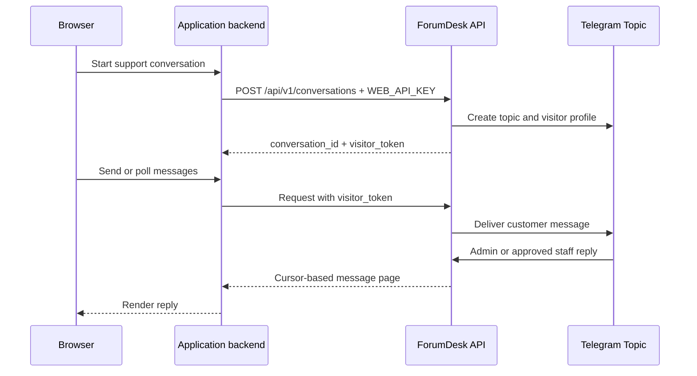

# ForumDesk Web API v1

[简体中文](API.md) · [Interactive HTML](API.html) · [OpenAPI 3.1](openapi.json) · [Project README](README_EN.md)

ForumDesk Web API connects website visitors to Telegram forum topics. Your application backend creates conversations with an integration key. A conversation-scoped `visitor_token` authenticates message delivery and polling.

## Integration model



The recommended architecture proxies ForumDesk through your application backend, keeping `WEB_API_KEY` and `visitor_token` server-side. Direct browser access requires an exact `WEB_ALLOWED_ORIGINS` entry.

## Base URL

```text
http://HOST:8080
```

Tailscale example:

```text
http://100.64.0.2:8980
```

## Authentication

| Credential | Use | Header |
|---|---|---|
| `WEB_API_KEY` | Create conversations from the application backend | `Authorization: Bearer WEB_API_KEY` |
| `visitor_token` | Send and poll messages for one conversation | `Authorization: Bearer VISITOR_TOKEN` |

The visitor token is returned once. ForumDesk stores only its SHA-256 digest.

## Health check

```bash
curl http://100.64.0.2:8980/healthz
```

```json
{"data":{"status":"ok"}}
```

## Create a conversation

```http
POST /api/v1/conversations
Authorization: Bearer WEB_API_KEY
Content-Type: application/json
```

| Field | Required | Limit | Description |
|---|---|---|---|
| `visitor_name` | Yes | 1–128 characters | Visitor display name |
| `email` | No | 254 bytes | Visitor email |
| `external_id` | No | 128 bytes | Application user or order ID |
| `page_url` | No | HTTP/HTTPS URL | Page where support started |

```bash
curl -X POST "http://100.64.0.2:8980/api/v1/conversations" \
  -H "Authorization: Bearer $FORUMDESK_API_KEY" \
  -H "Content-Type: application/json" \
  -d '{
    "visitor_name": "Ada",
    "email": "ada@example.com",
    "external_id": "customer-10001",
    "page_url": "https://www.example.com/pricing"
  }'
```

```json
{
  "data": {
    "id": "wc_...",
    "visitor_token": "wv_...",
    "status": "open",
    "created_at": "2026-09-07T10:00:00Z"
  }
}
```

A successful request creates the matching Telegram topic and visitor profile card.

## Send a message

```http
POST /api/v1/conversations/{conversation_id}/messages
Authorization: Bearer VISITOR_TOKEN
Content-Type: application/json
```

```json
{"text":"I would like to discuss pricing."}
```

Quoted reply:

```json
{
  "text": "Here is more context.",
  "reply_to_message_id": "wm_..."
}
```

After trimming, `text` must contain 1–4,000 characters. `reply_to_message_id` must reference a visible message in the same conversation.

## Poll messages

```http
GET /api/v1/conversations/{conversation_id}/messages?after=0&limit=50
Authorization: Bearer VISITOR_TOKEN
```

| Parameter | Default | Range |
|---|---:|---:|
| `after` | `0` | Non-negative cursor |
| `limit` | `50` | `1–100` |

```json
{
  "data": [
    {
      "id": "wm_...",
      "conversation_id": "wc_...",
      "sequence": 12,
      "direction": "staff",
      "text": "Hello, I can help with that.",
      "staff_name": "Sales",
      "reply_to_message_id": "wm_...",
      "visible": true,
      "created_at": "2026-09-07T10:01:00Z"
    }
  ],
  "meta": {"next_cursor": 12}
}
```

Use `meta.next_cursor` as the next `after` value. The example client polls every two seconds.

### Directions and events

| Value | Meaning |
|---|---|
| `customer` | Website customer message |
| `staff` | Telegram staff reply |
| `system` | System event |

After an administrator applies `/hide`, clients receive a visible tombstone event:

```json
{
  "direction": "system",
  "event": "message_hidden",
  "target_message_id": "wm_original",
  "sequence": 13,
  "visible": true
}
```

Remove the rendered message identified by `target_message_id`.

## Telegram visibility commands

| Command | Purpose |
|---|---|
| `/allow_staff` | Reply to a member and approve automatic publishing in this topic |
| `/deny_staff` | Revoke automatic publishing in this topic |
| `/staff` | List approved members |
| `/show` | Publish one internal message |
| `/hide` | Make one published message internal |

Administrator messages are visible by default. Regular member messages are internal by default.

## Errors

```json
{"error":{"code":"validation_error","message":"..."}}
```

| HTTP status | Meaning |
|---:|---|
| `400` | Invalid JSON, cursor, or pagination |
| `401` | Invalid integration or visitor credential |
| `409` | Conversation conflict |
| `422` | Invalid field or reply target |
| `429` | Rate limit; inspect `Retry-After` |
| `500` | Storage or internal error |
| `502` | Telegram upstream error |

## Limits and security

- The default rate limit is 60 requests per minute per integration key or conversation.
- JSON request bodies are limited to 16 KiB.
- Use complete CORS origins such as `https://support.example.com`, without paths or trailing slashes.
- Verify that the signed-in application user owns each `conversation_id`.
- Redact `WEB_API_KEY` and `visitor_token` from logs.
- Web API v1 currently uses text messages and cursor polling.

## Related files

- [OpenAPI 3.1 specification](openapi.json)
- [Browser client guide](examples/web-client_EN.md)
- [Runnable browser example](examples/web-client.html)
- [ForumDesk English README](README_EN.md)
