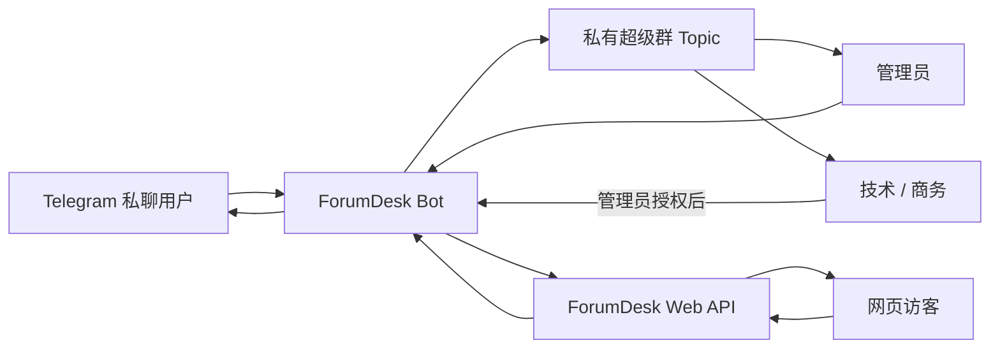

<div align="center">

# ForumDesk

**把 Telegram 私聊和网页客服统一接入独立 Forum Topic。**

[English](README_EN.md) · [交互式文档](README.html) · [Web API](API.html) · [OpenAPI](openapi.json)

[](https://github.com/paipaiio/telegram-customer-service-bot/actions/workflows/docker.yml)
[](go.mod)
[](https://github.com/paipaiio/telegram-customer-service-bot/pkgs/container/telegram-customer-service-bot)
[](LICENSE)

</div>

ForumDesk 是一个使用 Go 编写的自托管客服网关。Telegram 用户私聊 Bot，或网页访客通过 REST API 发起会话后，系统会在私有超级群中为每位客户创建独立 Topic。客服直接在 Topic 内协作，Bot 负责双向消息、引用、编辑、删除和可见性映射。

## 为什么使用 ForumDesk

传统转发 Bot 把所有客户消息混在一个聊天窗口里，消息量增加后容易串线。ForumDesk 使用 Telegram Forum Topic 作为工作区：

- 一位客户对应一个 Topic，历史上下文天然隔离。
- 管理员、技术和商务可在同一个 Topic 内协作。
- 普通成员发言默认仅内部可见，管理员决定按人或按消息外发。
- 同一个客服群同时承接 Telegram 私聊和网页客服。
- 单个 Go 进程、JSON 持久化、零第三方 Go 依赖，适合小型自托管部署。

## 功能

### 会话与消息

- 每位 Telegram 用户自动创建并复用独立 Topic。
- 每个网页会话自动创建独立 Topic，并附带来源资料卡。
- 支持文本、图片、语音、视频、文件等 Telegram 消息类型。
- Telegram 双向引用映射；网页消息通过 `reply_to_message_id` 保留引用。
- Telegram 客服编辑会同步修改用户端副本；Telegram 用户编辑会在 Topic 中引用原消息并追加变更。
- `/delete` 双端删除单条消息。
- `/clear` 清空双方对话，保留 Topic 和首条资料卡。
- `/clear_user` 仅清空客户端，保留管理端历史。

### 团队协作

- 群管理员发言默认对客户可见。
- 普通成员发言默认仅保留在 Topic 内。
- `/allow_staff`、`/deny_staff` 按 Topic 控制成员自动外发权限。
- `/show`、`/hide` 控制单条消息是否对客户可见。
- `/staff` 查看当前 Topic 已授权成员。

### 安全与部署

- `/protect on` 为之后发送的 Telegram 消息启用内容保护。
- Web API 使用集成密钥和会话级访客 Token 两层认证。
- 访客 Token 仅保存 SHA-256 摘要。
- 精确 CORS Origin、16 KiB 请求限制和每分钟速率限制。
- JSON 数据原子写入，Docker Volume 持久化。
- GitHub Actions 自动构建 GHCR `linux/amd64`、`linux/arm64` 镜像。

> Telegram 的 `protect_content` 主要限制转发与保存；截图表现由客户端和操作系统决定。该参数只影响启用后新发送的消息。

## 工作原理



Topic 负责客服协作和历史展示，`forumdesk.json` 保存用户、Topic、消息、网页会话和成员权限映射。

## 快速开始

### 1. 配置 Telegram

1. 在 [@BotFather](https://t.me/BotFather) 创建 Bot 并取得 Token。
2. 创建私有超级群并开启“话题”。
3. 将 Bot 设为管理员，授予发送消息、删除消息和管理话题权限。
4. 获取超级群 ID，格式通常为 `-100...`。

### 2. 创建环境变量

```bash
cp .env.example .env
```

编辑 `.env`：

```dotenv
BOT_TOKEN=123456789:YOUR_BOT_TOKEN
SUPPORT_GROUP_ID=-1001234567890
DATA_FILE=./data/forumdesk.json
HTTP_ADDR=:8080
WEB_API_KEY=replace-with-at-least-32-random-characters
WEB_ALLOWED_ORIGINS=https://www.example.com
WEB_RATE_LIMIT_PER_MINUTE=60
```

生成 API 密钥：

```bash
openssl rand -hex 32
```

`WEB_API_KEY` 只放在网站后端；浏览器使用创建会话时返回的单会话 `visitor_token`。

### 3. 使用 GHCR 镜像启动

```yaml
services:
  forumdesk:
    image: ghcr.io/paipaiio/telegram-customer-service-bot:latest
    pull_policy: always
    restart: unless-stopped
    env_file:
      - .env
    ports:
      - "127.0.0.1:8080:8080"
    volumes:
      - forumdesk-data:/app/data

volumes:
  forumdesk-data:
```

```bash
docker compose pull
docker compose up -d
docker compose logs -f forumdesk
```

健康检查：

```bash
curl http://127.0.0.1:8080/healthz
```

```json
{"data":{"status":"ok"}}
```

## 从源码运行

要求 Go 1.23 或更高版本：

```bash
set -a
source .env
set +a
go run ./cmd/forumdesk
```

质量检查：

```bash
go test -race ./...
go vet ./...
make coverage
```

构建容器：

```bash
docker compose up -d --build
```

## Web API

| 方法 | 路径 | 认证 | 用途 |
|---|---|---|---|
| `GET` | `/healthz` | 无 | 健康检查 |
| `POST` | `/api/v1/conversations` | `WEB_API_KEY` | 创建网页会话和 Topic |
| `POST` | `/api/v1/conversations/{id}/messages` | `visitor_token` | 发送消息或引用回复 |
| `GET` | `/api/v1/conversations/{id}/messages` | `visitor_token` | 使用游标增量读取消息 |

推荐接入方式：浏览器请求业务系统自己的同域后端，业务后端通过内网调用 ForumDesk。这样集成密钥始终留在服务器端。

- [交互式 API 文档](API.html)
- [OpenAPI 3.1](openapi.json)
- [浏览器接入示例](examples/web-client.html)

## 管理员命令

| 命令 | 作用 |
|---|---|
| `/protect on\|off` | 查看或设置之后发送的消息保护 |
| `/delete`、`/del` | 回复消息后双端删除 |
| `/clear` + `/clear confirm` | 清空双方消息，保留 Topic 和资料卡 |
| `/clear_user` + `/clear_user confirm` | 仅清空客户端消息 |
| `/allow_staff` | 回复成员消息，允许该成员在当前 Topic 自动外发 |
| `/deny_staff` | 取消该成员在当前 Topic 的自动外发权限 |
| `/staff` | 查看当前 Topic 已授权成员 |
| `/show` | 回复内部消息，单独设为对客户可见 |
| `/hide` | 回复已发布消息，转为仅管理端可见 |
| `/help` | 显示完整命令说明 |

用户私聊菜单仅显示 `/delete` 和 `/help`。成员是否能浏览某个 Topic 由 Telegram 群权限决定；上述命令控制消息是否外发给客户。

## 数据与升级

数据保存在 Docker Volume 的 `/app/data/forumdesk.json`。升级镜像不会删除 Volume：

```bash
docker compose pull
docker compose up -d
```

备份：

```bash
docker compose exec forumdesk cat /app/data/forumdesk.json \
  > forumdesk-backup-$(date +%Y%m%d-%H%M%S).json
```

避免使用 `docker compose down -v`，该命令会删除 Compose 数据卷。

## 项目结构

```text
cmd/forumdesk/       程序入口
internal/app/        Telegram 长轮询运行器
internal/bot/        Topic 路由与客服控制
internal/config/     环境变量加载与校验
internal/store/      JSON 原子持久化
internal/telegram/   Telegram Bot API 客户端
internal/webapi/     网页客服 REST API
examples/            网页接入示例
API.html             交互式 API 文档
openapi.json         OpenAPI 3.1 规范
```

## 当前边界

- Telegram Bot API 不推送普通消息的删除事件；双端删除请使用 `/delete`。
- Topic 没有独立头像，ForumDesk 使用客户头像资料卡模拟识别效果。
- 当前网页 API 使用游标轮询，消息体为 1–4000 字符文本。
- 当前存储适合单实例；多实例部署可迁移到 PostgreSQL 或其他共享存储。

## 参与贡献

欢迎通过 Issue 提交缺陷、功能建议和部署反馈。提交代码前请运行：

```bash
go test -race ./...
go vet ./...
```

## 许可证

本项目使用 [CC BY-NC-SA 4.0](LICENSE)：允许署名、非商业使用、修改和分发，衍生作品需要使用相同许可方式。
