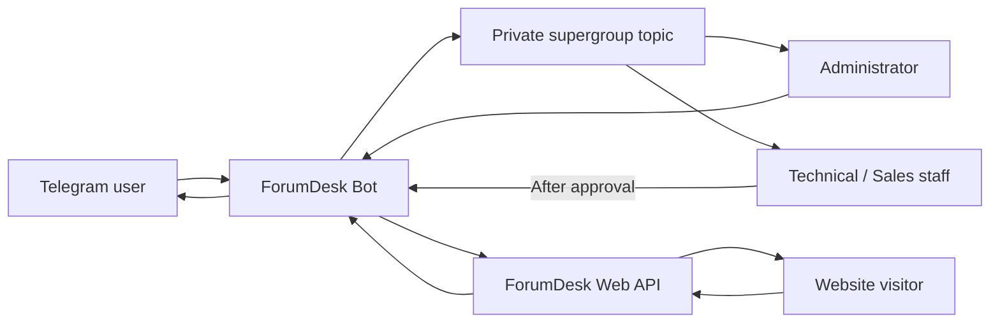

<div align="center">

# ForumDesk

**Bridge Telegram DMs and website support chats into dedicated forum topics.**

[简体中文](README.md) · [Web API](API_EN.md) · [Browser integration](examples/web-client_EN.md) · [Interactive docs](README_EN.html)

[](https://github.com/paipaiio/telegram-customer-service-bot/actions/workflows/docker.yml)
[](go.mod)
[](https://github.com/paipaiio/telegram-customer-service-bot/pkgs/container/telegram-customer-service-bot)
[](LICENSE)

</div>

ForumDesk is a self-hosted customer support gateway written in Go. When a Telegram user messages the bot, or a website visitor starts a conversation through the REST API, ForumDesk creates a dedicated topic in a private supergroup. Your team collaborates inside the topic while the bot maps messages, quotes, edits, deletion, and visibility across channels.

## Why ForumDesk

Traditional forwarding bots mix every customer into one chat. ForumDesk uses Telegram forum topics as a lightweight support workspace:

- One customer maps to one topic with isolated history.
- Administrators, technical staff, and sales staff collaborate in the same topic.
- Regular members are internal by default; administrators decide who or what is published.
- One support group handles both Telegram DMs and website conversations.
- A single Go process, atomic JSON persistence, and no third-party Go dependencies keep deployment small.

## Features

### Conversations and messages

- Automatically create and reuse one topic for each Telegram user.
- Create a topic and visitor profile card for each web conversation.
- Relay Telegram text, photos, voice, video, documents, and other message types.
- Map Telegram quotes both ways and preserve web quotes through `reply_to_message_id`.
- Sync Telegram staff edits in place; append Telegram user edits in the topic with a reference to the original.
- Delete one mapped message from both sides with `/delete`.
- Clear both sides while keeping the topic and profile card with `/clear`.
- Clear the customer side while retaining the admin history with `/clear_user`.

### Team collaboration

- Group administrator messages are customer-visible by default.
- Regular member messages stay internal by default.
- Grant or revoke automatic publishing per member and per topic with `/allow_staff` and `/deny_staff`.
- Publish or hide one message with `/show` and `/hide`.
- List approved members with `/staff`.

### Security and deployment

- Apply Telegram content protection to subsequent messages with `/protect on`.
- Authenticate the Web API with an integration key and conversation-scoped visitor tokens.
- Store only SHA-256 digests of visitor tokens.
- Enforce exact CORS origins, a 16 KiB request limit, and per-minute rate limits.
- Persist JSON atomically in a Docker volume.
- Build GHCR images for `linux/amd64` and `linux/arm64` through GitHub Actions.

> Telegram `protect_content` primarily restricts forwarding and saving. Screenshot behavior depends on the client and operating system. The flag applies only to messages sent after it is enabled.

## Architecture



Topics provide the collaboration history. `forumdesk.json` stores user, topic, message, web conversation, and staff visibility mappings.

## Quick Start

### 1. Configure Telegram

1. Create a bot with [@BotFather](https://t.me/BotFather) and copy its token.
2. Create a private supergroup and enable **Topics**.
3. Add the bot as an administrator with **Send Messages**, **Delete Messages**, and **Manage Topics** permissions.
4. Find the supergroup ID, normally starting with `-100`.

### 2. Configure environment variables

```bash
cp .env.example .env
```

Edit `.env`:

```dotenv
BOT_TOKEN=123456789:YOUR_BOT_TOKEN
SUPPORT_GROUP_ID=-1001234567890
DATA_FILE=./data/forumdesk.json
HTTP_ADDR=:8080
WEB_API_KEY=replace-with-at-least-32-random-characters
WEB_ALLOWED_ORIGINS=https://www.example.com
WEB_RATE_LIMIT_PER_MINUTE=60
```

Generate an API key:

```bash
openssl rand -hex 32
```

Keep `WEB_API_KEY` on your application server. Browsers use the conversation-scoped `visitor_token` returned when a conversation is created.

### 3. Start the GHCR image

```yaml
services:
  forumdesk:
    image: ghcr.io/paipaiio/telegram-customer-service-bot:latest
    pull_policy: always
    restart: unless-stopped
    env_file:
      - .env
    ports:
      - "127.0.0.1:8080:8080"
    volumes:
      - forumdesk-data:/app/data

volumes:
  forumdesk-data:
```

```bash
docker compose pull
docker compose up -d
docker compose logs -f forumdesk
```

Check health:

```bash
curl http://127.0.0.1:8080/healthz
```

```json
{"data":{"status":"ok"}}
```

## Run from Source

Go 1.23 or newer is required:

```bash
set -a
source .env
set +a
go run ./cmd/forumdesk
```

Run quality checks:

```bash
go test -race ./...
go vet ./...
make coverage
```

Build locally with Docker:

```bash
docker compose up -d --build
```

## Web API

| Method | Path | Authentication | Purpose |
|---|---|---|---|
| `GET` | `/healthz` | None | Health check |
| `POST` | `/api/v1/conversations` | `WEB_API_KEY` | Create a web conversation and topic |
| `POST` | `/api/v1/conversations/{id}/messages` | `visitor_token` | Send a message or quoted reply |
| `GET` | `/api/v1/conversations/{id}/messages` | `visitor_token` | Poll messages with an incremental cursor |

The recommended integration keeps the browser on your application's origin. Your application backend calls ForumDesk over a private network, so the integration key remains server-side.

- [Web API documentation](API_EN.md)
- [Interactive API documentation](API.html)
- [OpenAPI 3.1 specification](openapi.json)
- [Browser client guide](examples/web-client_EN.md)
- [Runnable browser example](examples/web-client.html)

## Administrator Commands

| Command | Purpose |
|---|---|
| `/protect on\|off` | View or change protection for subsequent messages |
| `/delete`, `/del` | Reply to delete one mapped message from both sides |
| `/clear` + `/clear confirm` | Clear both sides while keeping the topic and profile card |
| `/clear_user` + `/clear_user confirm` | Clear only the customer side |
| `/allow_staff` | Reply to a member and allow automatic publishing in this topic |
| `/deny_staff` | Revoke that member's automatic publishing permission in this topic |
| `/staff` | List approved members in this topic |
| `/show` | Reply to an internal message and publish it |
| `/hide` | Reply to a published message and make it internal |
| `/help` | Show the full command reference |

Private users only see `/delete` and `/help`. Telegram group permissions determine which topics a member can browse; these commands determine whether a message is delivered to the customer.

## Data and Upgrades

Runtime data lives at `/app/data/forumdesk.json` in a Docker volume. Pulling a new image preserves the volume:

```bash
docker compose pull
docker compose up -d
```

Create a backup:

```bash
docker compose exec forumdesk cat /app/data/forumdesk.json \
  > forumdesk-backup-$(date +%Y%m%d-%H%M%S).json
```

Avoid `docker compose down -v`, which removes the Compose volume.

## Project Structure

```text
cmd/forumdesk/       application entrypoint
internal/app/        Telegram long-polling runner
internal/bot/        topic routing and staff controls
internal/config/     environment loading and validation
internal/store/      atomic JSON persistence
internal/telegram/   Telegram Bot API client
internal/webapi/     web support REST API
examples/            browser integration example
API_EN.md            default Web API documentation
API.html             interactive API documentation
openapi.json         OpenAPI 3.1 specification
```

## Current Scope

- The Telegram Bot API does not send ordinary message-deletion updates. Use `/delete` for mapped two-side deletion.
- Forum topics do not have individual avatars; ForumDesk posts a customer profile card with the avatar instead.
- Web API v1 uses cursor polling and accepts text messages between 1 and 4,000 characters.
- The current store targets a single instance. Multi-instance deployments can move mappings to PostgreSQL or another shared store.

## Contributing

Issues, feature requests, deployment feedback, and pull requests are welcome. Before opening a pull request, run:

```bash
go test -race ./...
go vet ./...
```

## License

ForumDesk is licensed under [CC BY-NC-SA 4.0](LICENSE). Attribution, non-commercial use, modification, and redistribution are permitted under the same license terms.
